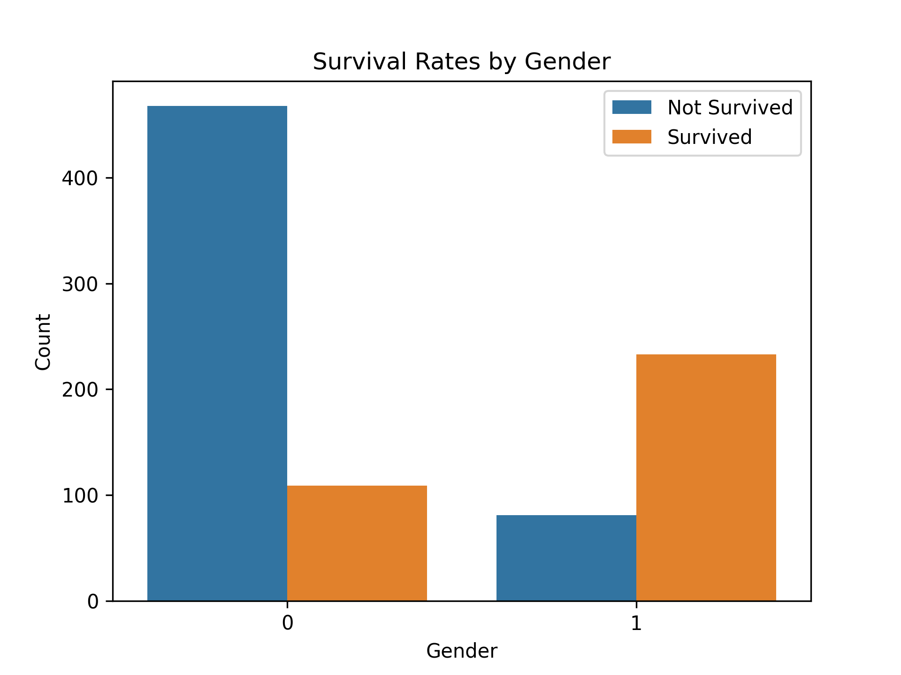
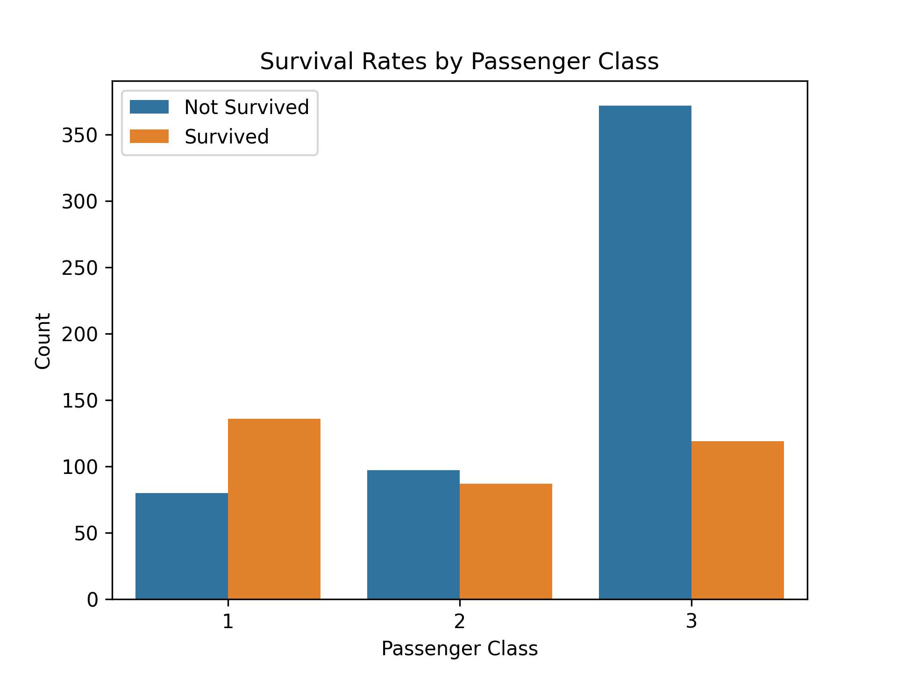
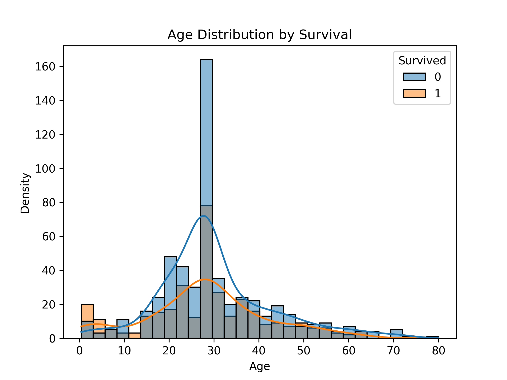
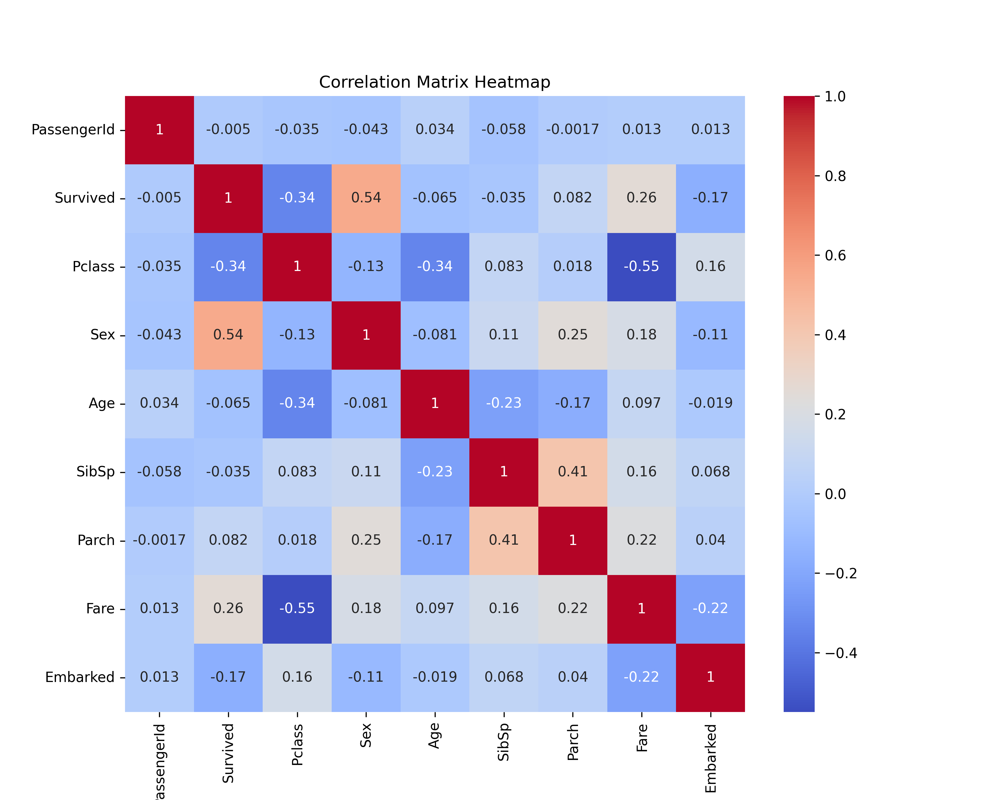
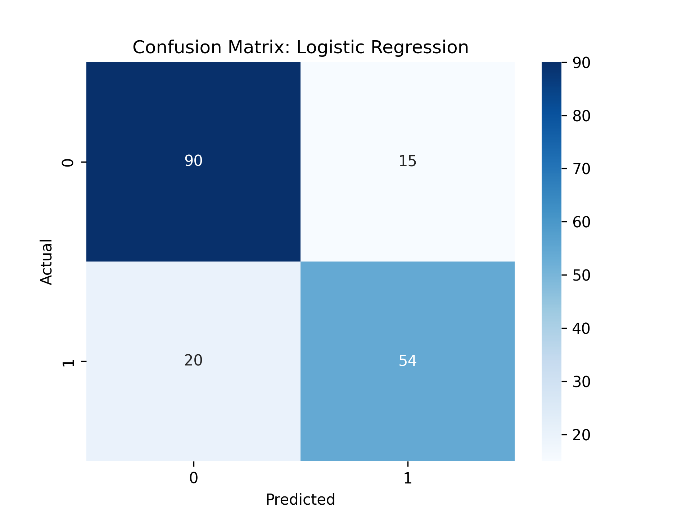
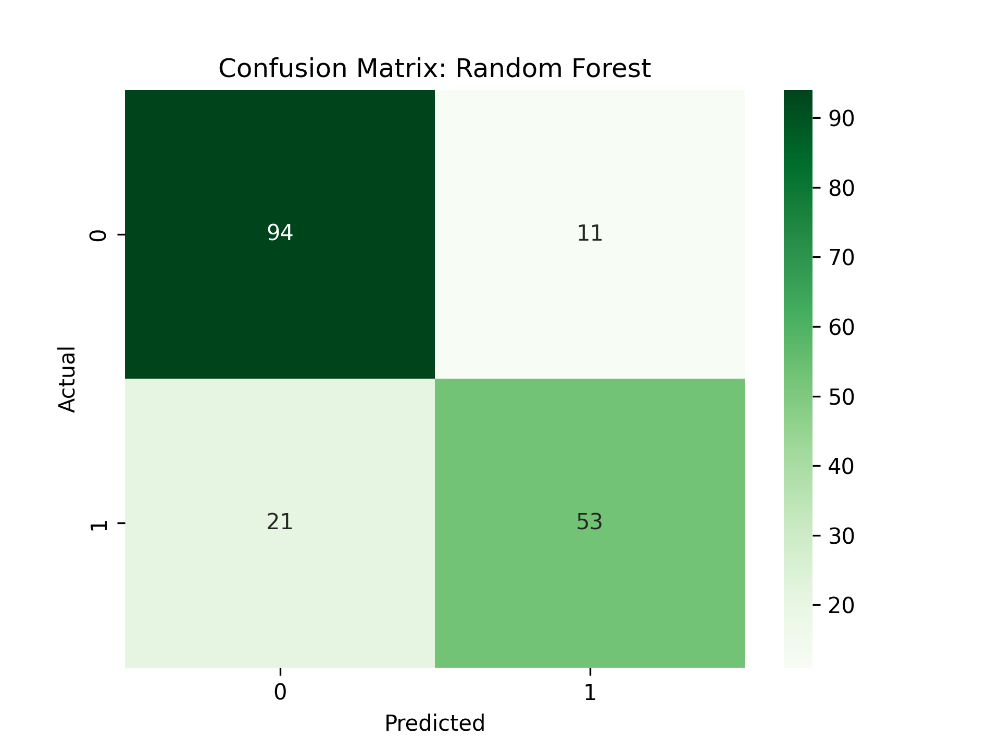
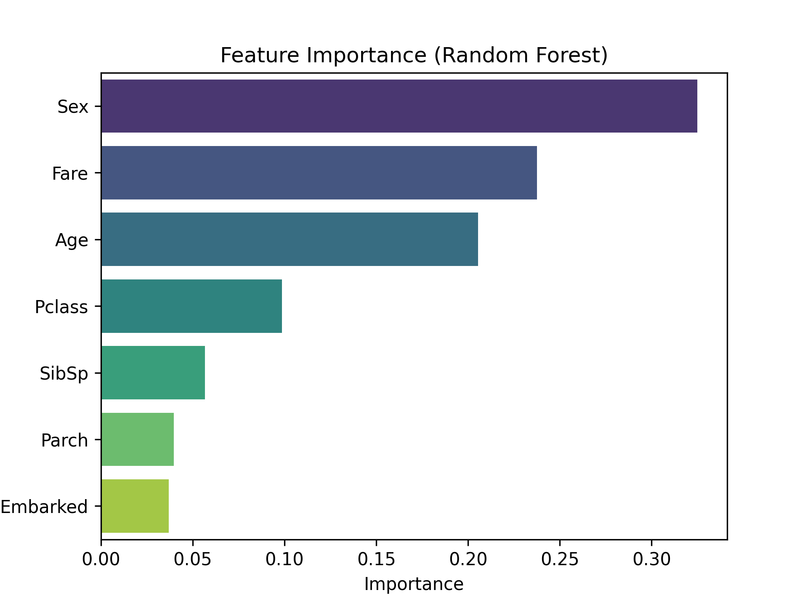

# Titanic Survival Prediction Project

## Overview
This project analyzes the famous Titanic dataset to predict passenger survival using exploratory data analysis (EDA) and machine learning techniques. Key insights were derived through visualizations, and predictive models were built using Logistic Regression and Random Forest algorithms.

---

## Key Results
- **Logistic Regression**:
  - Accuracy: 81%
  - F1 Score: 76%
- **Random Forest**:
  - Accuracy: 82%
  - F1 Score: 77%
- **Feature Importance**:
  - Key predictors: `Sex`, `Pclass`, `Age`.

---

## Visualizations
### Survival Rates by Gender

### Survival Rates by Passenger Class

### Age Distribution by Survival

### Correlation Heatmap

### Confusion Matrices
- Logistic Regression:  
  
- Random Forest:  
  

### Feature Importance

---

## Repository Structure
